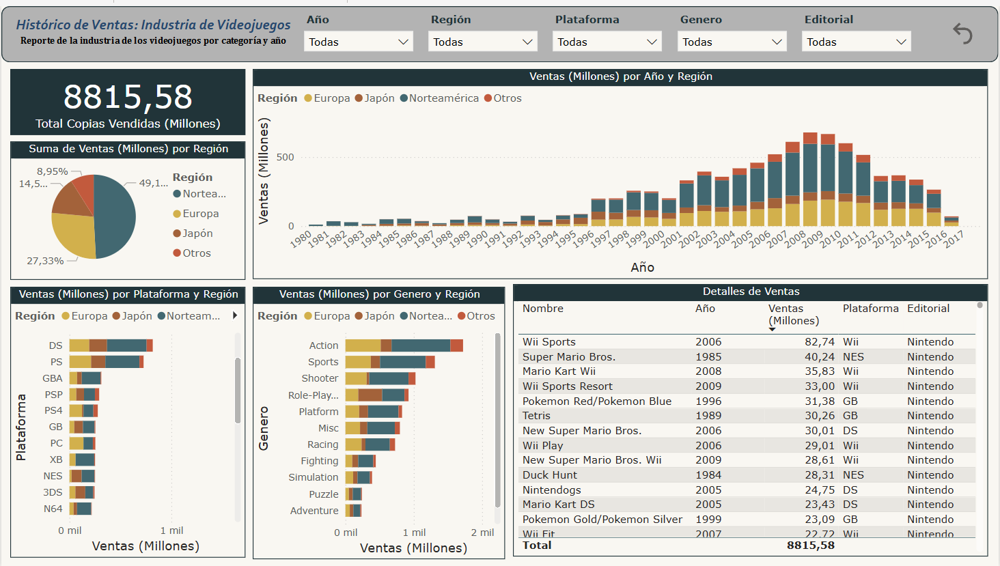
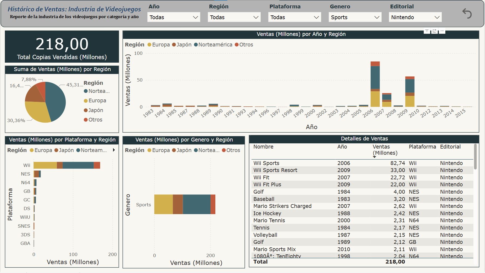

# 🎮 Ventas de Videojuegos

## 📝 Descripción

Este proyecto de Power BI analiza las ventas globales de videojuegos a lo largo de los años, segmentadas por región (Norteamérica, Europa, Japón y Resto del mundo). El objetivo es identificar tendencias del mercado, comparar el rendimiento de distintas plataformas y géneros, y detectar patrones de consumo por zona geográfica.

## 📂 Contenido del Proyecto

- `venta-videojuegos.pbix`: Archivo principal del dashboard en Power BI.
- `Ventas+Videojuegos.xlsx`: Dataset con información de ventas por videojuego.

## 🎯 Objetivos del Dashboard

- Visualizar la evolución de ventas globales de videojuegos por año.
- Comparar el rendimiento entre plataformas (PS, Xbox, Nintendo, PC, etc.).
- Analizar qué géneros son más populares por región.

## 🖼️ Vista Previa

## 🛠️ Herramientas Utilizadasa

- **Power BI Desktop**
- **Power Query** para limpieza y transformación de datos
- **Dataset público de Kaggle:** [Video Game Sales](https://www.kaggle.com/datasets/thedevastator/global-video-game-sales-and-reviews/data)

## ⚙️ Cómo usar este proyecto

1. Clonar este repositorio o descargar los archivos manualmente.
2. Abrir `venta-videojuegos.pbix` en Power BI Desktop.
3. Verificar que la fuente de datos `Ventas+Videojuegos.xlsx` esté en la ruta correcta o reconfigurarla desde Power Query.
4. Explorar el dashboard por filtros: año, región, plataforma, género, editorial.

## 📊 Métricas Clave

- **Ventas globales (en millones de unidades)**
- **Distribución de ventas por género y región**
- **Evolución de ventas anuales**
- **Ventas por plataforma**
- **Ventas por Genero**